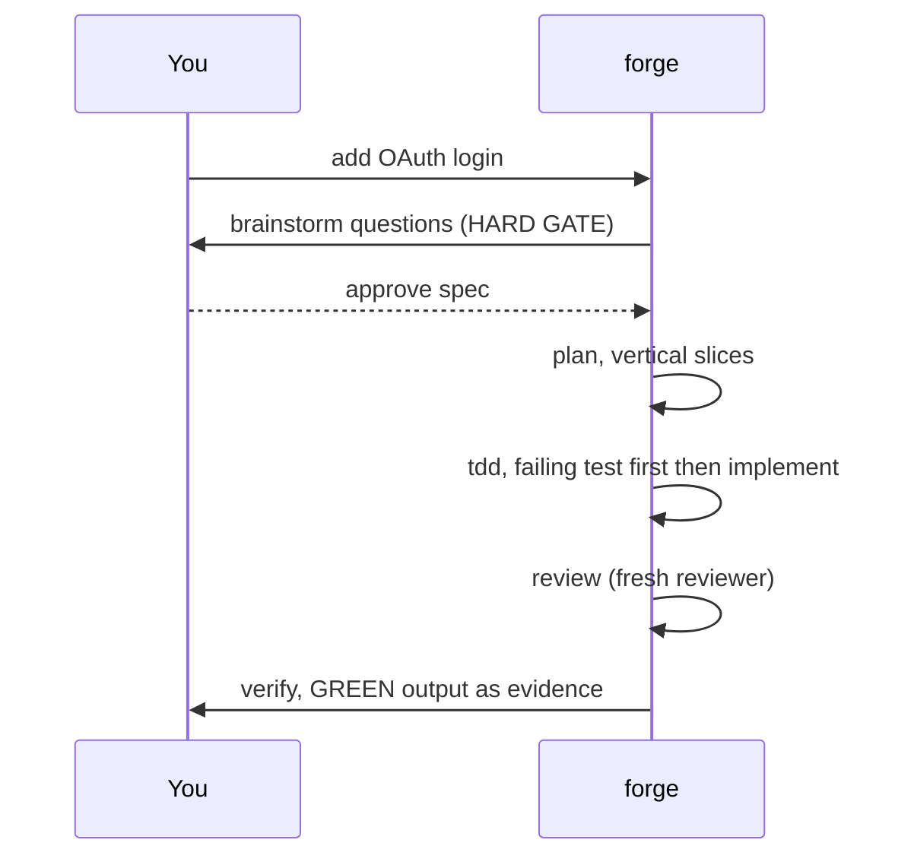
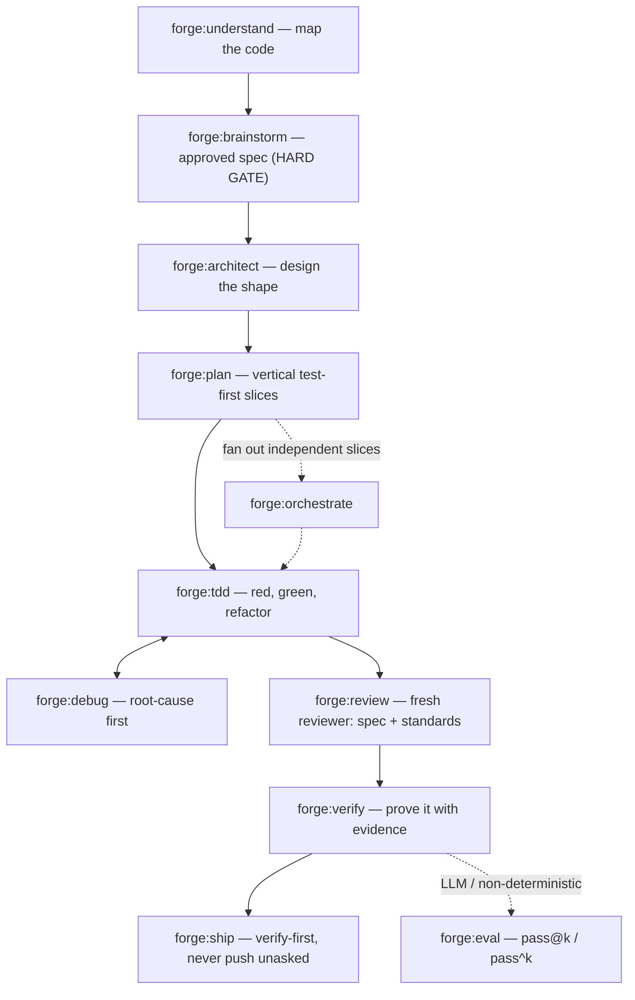
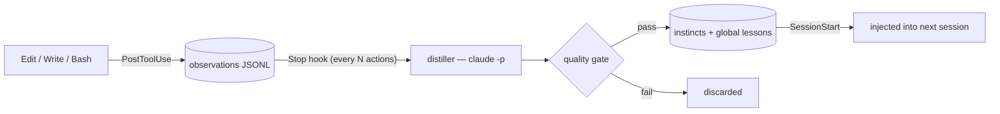
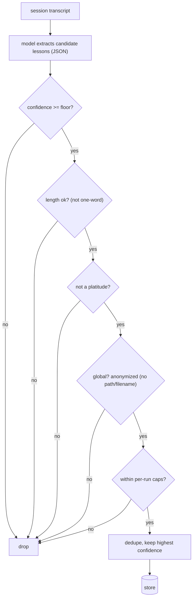
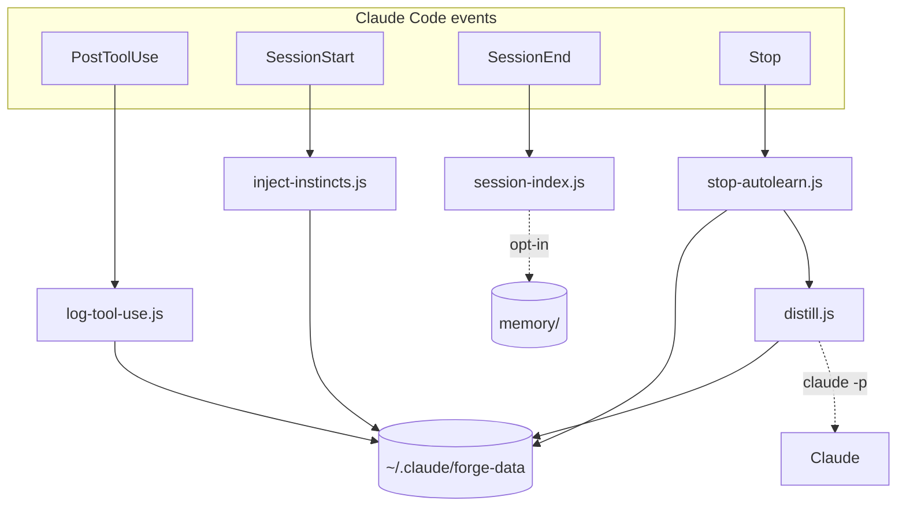

<a id="top"></a>

<div align="center">

<pre>
███████╗ ██████╗ ██████╗  ██████╗ ███████╗
██╔════╝██╔═══██╗██╔══██╗██╔════╝ ██╔════╝
█████╗  ██║   ██║██████╔╝██║  ███╗█████╗  
██╔══╝  ██║   ██║██╔══██╗██║   ██║██╔══╝  
██║     ╚██████╔╝██║  ██║╚██████╔╝███████╗
╚═╝      ╚═════╝ ╚═╝  ╚═╝ ╚═════╝ ╚══════╝
</pre>

**A curated, state-of-the-art SDLC skill set for Claude Code — with a memory layer that learns as you work.**

<p>
  
  
  
  
  
  
</p>

<p>
  <a href="#install"><b>Install</b></a> ·
  <a href="#why-forge">Why</a> ·
  <a href="#the-16-skills">Skills</a> ·
  <a href="#the-memory-layer">Memory</a> ·
  <a href="#cross-session-recall--personalization-opt-in">Recall</a> ·
  <a href="#configuration">Config</a> ·
  <a href="#-what-the-hooks-actually-do">Hooks</a> ·
  <a href="#faq">FAQ</a>
</p>

</div>

Most people accumulate a dozen overlapping Claude Code skill packs and then have to remember which to invoke. **forge replaces that pile with one cohesive plugin** — the single best technique for each phase of software work (credited in [CREDITS.md](./CREDITS.md)), wired into one lifecycle, plus a memory layer so your agent stops repeating mistakes.

```
understand → brainstorm → architect → plan → tdd ⇄ debug → review → verify → ship
                       ( + orchestrate · eval · design-ui · principles · learn · recall )
```

> [!IMPORTANT]
> forge ships **hooks** that write a local activity log and run **background `claude -p` calls on your own subscription** to learn from your sessions. It's all local, fully disclosed in [What the hooks actually do](#-what-the-hooks-actually-do), and disabled with one setting (`FORGE_AUTOLEARN=off`).

---

## Who it's for

forge is for you if:

- **You juggle several skill packs** and forget which to invoke → forge is *one* namespaced set with a clear hand-off chain.
- **You want discipline enforced, not suggested** → test-first, root-cause-first, and evidence-before-"done" as *falsifiable rules*.
- **You want your agent to stop repeating mistakes** → a memory layer that learns per-project *and* cross-project.
- **You care about privacy** → everything local, every hook disclosed, one-switch off.

Not a fit if you need a zero-hook plugin that never touches your tokens — forge's learning loop makes background model calls (off by a single setting).

---

## Install

**Option A — marketplace (one-liner):**

```text
/plugin marketplace add vasu-devs/Forge
/plugin install forge@forge
```

**Option B — clone into your skills directory** (recommended if you want the manual `forge-store` / `forge-mem` CLIs, which assume this path):

```bash
git clone https://github.com/vasu-devs/Forge ~/.claude/skills/forge
```

Then `/reload-plugins` (or restart Claude Code) and verify:

```bash
claude plugin list        # look for:  forge@skills-dir   (or  forge@forge)
```

Skills now appear as `forge:tdd`, `forge:debug`, `forge:design-ui`, etc. The data store (`~/.claude/forge-data/`) is created lazily on first use; the optional [recall add-on](#cross-session-recall--personalization-opt-in) needs one extra `npm install`.

---

## Why forge

A raw model has predictable failure modes: it assumes silently, over-builds, edits code it doesn't understand, patches symptoms instead of root causes, and claims success it never verified. forge is an opinionated cure for each, expressed as **falsifiable rules** rather than vibes.

| | |
|---|---|
| 🔁 **Full SDLC** | 16 hand-off-linked skills, from understanding code to shipping it |
| 🗺️ **Live code map** | a self-updating dependency graph — god-nodes · modules · blast-radius · cycles · dead-files — never stale |
| 🧠 **Learns as you work** | a background distiller turns your sessions into durable "instincts" |
| 🌍 **Two memory tiers** | per-project instincts + anonymized cross-project lessons |
| 🔎 **Cross-session recall** | *(opt-in)* local semantic search over past chats + `claude --resume` links |
| 🧩 **Namespaced** | `forge:*` — no collisions with other skill packs |
| 📦 **Zero core deps** | plain Node; only the recall add-on needs an `npm install` |
| 🔒 **Local & disclosed** | no telemetry; every hook documented; one-switch off |
| 🖥️ **Cross-platform** | macOS, Linux, Windows (path-normalized project keys) |

**Four ideas run through everything:** *name the rationalization and forbid it* · *mechanically-checkable rules over vague advice* · *separate deterministic scaffolding from model judgment* · *build verification into the work.*

---

## See it in action

You rarely call skills by name — they trigger from what you're doing. A typical feature slice:



…and the memory loop, across sessions:

```text
[session 1]  you correct it: "stop bumping timeouts, find the root cause"
             → forge distills an anonymized GLOBAL lesson in the background

[session 2 — any project]  SessionStart injects:
   ## forge — global lessons (cross-project)
   - When intermittent test failures tempt a retry/timeout patch →
     investigate the root cause first (race, shared state)   (conf 0.85)
```

---

## Requirements

| Requirement | Why |
|---|---|
| **Claude Code v2.1+** | Plugin hooks auto-load from `hooks/hooks.json` in this version. |
| **Node.js** on `PATH` | Core hook scripts are plain Node, **zero dependencies**. |
| **Authenticated `claude` CLI** | The background distiller/indexer call `claude -p` on your own plan. |
| *(optional)* `npm install` | Only for the `forge:recall` add-on (one local embedding model). |

Runs on macOS, Linux, and Windows (PowerShell or msys); project keys are path-normalized across all three. Fully compatible with other skill packs — use Claude Code's `skillOverrides` if any compete to trigger.

---

## Using forge day to day

You mostly **don't invoke skills manually** — they trigger at the right phase. The intended flow:



`forge:design-ui` slots in for frontend; `forge:principles` is the always-on doctrine; `forge:learn` runs automatically; `forge:recall` answers "what did we do before?". You can always invoke one explicitly — *"use forge:architect"* or `/forge:debug`.

---

## The 16 skills

<details open>
<summary><b>📋 All 16 skills</b> — the mechanism each one enforces (click to collapse)</summary>

<br>

| Skill | Phase | Key mechanism it enforces |
|---|---|---|
| **`forge:principles`** | doctrine | Think before coding · simplicity first · surgical changes · goal-driven execution · evidence over assertion. Each ships a falsifiable *test*. |
| **`forge:understand`** | orient | Map unfamiliar code *before* editing; iterative retrieval (learn the repo's vocabulary); output entry points, key modules, call path, hotspots. |
| **`forge:brainstorm`** | spec | One-question-at-a-time into an approved written spec. **Hard gate**: no implementation until you approve. |
| **`forge:architect`** | design | **Search-first** (Adopt/Extend/Compose/Build); **design-it-twice**; judge on depth, the deletion test, the two-adapter seam rule. |
| **`forge:plan`** | breakdown | **Vertical tracer-bullet slices**, each leaving the program working. **No placeholders** — concrete enough for a context-free executor. |
| **`forge:tdd`** | implement | Iron law: **no production code without a failing test first**; watch it fail; one test → one slice; refactor only on green. |
| **`forge:debug`** | fix | Root-cause before any patch. Build the fastest pass/fail signal; 3–5 falsifiable hypotheses; **after 3 failed fixes, question the architecture**. |
| **`forge:review`** | quality | A **fresh reviewer that didn't write the code**, on two axes — *Spec* and *Standards* — side by side. Severity-tiered. |
| **`forge:verify`** | proof | No completion claim without **fresh evidence this turn** (claim→required-proof table). For UI: render it and look. |
| **`forge:ship`** | land | Verify first · detect environment · merge/PR/keep options · provenance-aware cleanup · **never push without asking**. |
| **`forge:orchestrate`** | parallelize | Run genuinely independent work concurrently; the independence rule; per-agent crafted context; worktree isolation; fresh reviewer per task. |
| **`forge:eval`** | measure | Eval-driven dev for LLM/non-deterministic work. **pass@k** vs **pass^k**; grader hierarchy; baseline-without-the-skill validation. |
| **`forge:design-ui`** | frontend | Anti-slop UI. Tunable dials; mechanically-checkable bans; commit to one direction; render-and-look before shipping. |
| **`forge:learn`** | memory | Distill durable lessons into project instincts + anonymized global lessons. Runs automatically; also invokable. |
| **`forge:recall`** | memory (x-session) | Semantic search of PAST sessions + **resume a chat** (`claude --resume <id>`); local embeddings + a personalization profile. Opt-in. |
| **`forge:graph`** | structure | A **live, self-updating** code map: god-nodes (most-depended-on), module/cluster architecture, and `neighbors`/`impact` (blast-radius) queries. Zero-dep; patched by the hooks so it never goes stale. |

</details>

<div align="right"><sub><a href="#top">↑ back to top</a></sub></div>

---

## The memory layer

This is what makes forge get better over time — a loop of hooks backed by local files under `~/.claude/forge-data/`.



1. **Capture** (`PostToolUse`) — logs each `Edit`/`Write`/`Bash` as one compact line to a project-scoped observations log. Survives context compaction.
2. **Learn** (`Stop` → detached `distill.js`) — after `FORGE_LEARN_EVERY` (default 8) actions, a small model extracts candidate lessons, which pass a strict quality gate before being stored. Non-blocking; silently no-ops on error.
3. **Recall** (`SessionStart`) — the highest-confidence lessons (+ profile, if installed) are injected into the next session, capped and confidence-sorted.

<details>
<summary><b>🔬 The quality gate</b> — the funnel every candidate lesson must clear (click to expand)</summary>

<br>



</details>

**Two tiers:** *project instincts* (`instincts/<project>.jsonl`, load only in that repo) and *global lessons* (`global-lessons.jsonl` + readable `LESSONS.md`, anonymized, load everywhere). Both store one tiny JSON object per line:

```json
{ "trigger": "when intermittent test failures tempt a retry/timeout patch",
  "action":  "investigate the root cause first (race, shared state) before adding any wait",
  "confidence": 0.85 }
```

<div align="right"><sub><a href="#top">↑ back to top</a></sub></div>

---

## Live code map (`forge:graph`)

forge keeps a **dependency graph of the repo that updates itself** — so the agent always has *current* structural context instead of a stale one-time scan. Zero-dependency, fully local, a native synthesis of the three code-graph ideas:

- **god-nodes** (graphify) — the most-depended-on files; the real hotspots.
- **module / cluster map** (Understand-Anything) — architecture at a glance.
- **neighbors / impact** (CodeGraph) — who imports a file, and the transitive blast radius of changing it.

Built once, then patched after every turn by the `Stop` hook (mtime-diff — only changed files reparse), with a compact map injected at `SessionStart`. Query it directly:

```bash
G=~/.claude/skills/forge/scripts/graph.js
node "$G" map               # god-nodes + modules
node "$G" neighbors <file>  # imports ↑ / importers ↓
node "$G" impact <file>     # transitive blast radius
```

Edges are static imports for JS/TS (incl. tsconfig `@/…` aliases), Python, C/C++, Ruby, and Rust, resolved to real files; it respects `.gitignore` and also surfaces **cycles, dead files, and orchestrators**. It won't follow dynamic dispatch, monorepo workspace-package imports, or languages without an extractor yet (Go/Java/Kotlin/PHP/C#/Swift appear as edgeless nodes) — a high-accuracy skeleton, not a completeness proof. Disable with `FORGE_GRAPH=off`.

---

## Cross-session recall & personalization (opt-in)

forge can also build a **semantic memory of your past chats** plus a **personalization profile** ("who you are / how you work") that auto-loads each session. One dependency (a local ONNX embedding model), so it's opt-in:

```bash
cd ~/.claude/skills/forge/memory && npm install   # one-time
```

A `SessionEnd` hook then indexes finished sessions in the background. Use it via `forge:recall` (*"what did we decide about X?"*) — every memory carries a `claude --resume <id>` link to reopen the chat. **100% local, never transmitted.** Design + citations: [`docs/research/cross-session-memory-and-personalization.md`](docs/research/cross-session-memory-and-personalization.md).

---

## Command reference

> Paths assume the recommended install at `~/.claude/skills/forge`.

```bash
# Lessons & instincts — zero-dependency, always available
S=~/.claude/skills/forge/scripts/forge-store.js
node $S list | list-global | observations [N] | clear-observations
node $S add        '{"trigger":"...","action":"...","confidence":0.8}'
node $S add-global '{"trigger":"...","action":"...","confidence":0.8}'
node $S remove "<substring>" | remove-global "<substring>"

# Cross-session memory — after the add-on `npm install`
M=~/.claude/skills/forge/memory/forge-mem.mjs
node $M index             # ingest past transcripts   (--all | --limit N)
node $M recall "<query>"  # semantic recall + resume links
node $M chats  "<query>"  # find a past chat to reopen
node $M profile           # (re)build profile.md
node $M status
```

---

## Configuration

Set under `"env"` in `~/.claude/settings.json`:

```json
{ "env": { "FORGE_LEARN_MODEL": "claude-sonnet-4-6", "FORGE_LEARN_EVERY": "12" } }
```

<details>
<summary><b>⚙️ All configuration options</b> (click to expand)</summary>

<br>

| Variable | Default | Effect |
|---|---|---|
| `FORGE_AUTOLEARN` | `on` | `off` disables the background distiller entirely (skills still work). |
| `FORGE_LEARN_EVERY` | `8` | Distill after this many new actions. Higher = leaner / less frequent / cheaper. |
| `FORGE_LEARN_MODEL` | `claude-haiku-4-5-20251001` | Distillation model. `claude-sonnet-4-6` = sharper lessons, more tokens. |
| `FORGE_LEARN_MIN_CONF` | `0.6` | Quality floor — drops candidate lessons below this confidence. |
| `FORGE_INSTINCT_MAX` / `_MIN_CONF` | `12` / `0` | Cap & floor for injected **project instincts**. |
| `FORGE_GLOBAL_MAX` / `_MIN_CONF` | `15` / `0` | Cap & floor for injected **global lessons** (raise to `0.7+` as the list grows). |
| `FORGE_DATA_DIR` | `~/.claude/forge-data` | Relocate the data directory. |
| `FORGE_AUTOINDEX` | `on` | *(add-on)* `off` disables session indexing at `SessionEnd`. |
| `FORGE_EMBED_MODEL` | `Xenova/all-MiniLM-L6-v2` | *(add-on)* local embedding model. |
| `FORGE_PROFILE_EVERY` | `3` | *(add-on)* rebuild the profile every N indexed sessions. |

**Live code map (`forge:graph`):** `FORGE_GRAPH=off` turns the whole subsystem off; `FORGE_GRAPH_MAX_FILES` (default `5000`) caps how many files are scanned.

</details>

*Cost:* the distiller runs on your own plan. To keep it lean, raise `FORGE_LEARN_EVERY` and/or keep Haiku. `FORGE_DISTILL_DRYRUN` / `FORGE_DISTILL_MOCK` exercise the pipeline without spending tokens (see [CONTRIBUTING.md](./CONTRIBUTING.md)).

<div align="right"><sub><a href="#top">↑ back to top</a></sub></div>

---

## ⚠️ What the hooks actually do

Transparency, because always-on hooks deserve it. When forge is enabled:

- **`PostToolUse`** → writes one line per `Edit`/`Write`/`Bash` to `~/.claude/forge-data/observations/<project>.jsonl`. Stays on your machine.
- **`Stop`** → patches the live **code map** (cheap, fully local) and — throttled — may spawn a background `claude -p` call **on your subscription** to distill lessons. Detached, never blocks you.
- **`SessionStart`** → injects the local lessons, the personalization profile (if present), and the live **code map**, and kicks off a background graph refresh.
- **`SessionEnd`** → *only if the memory add-on is installed* — indexes the finished session locally. Disable with `FORGE_AUTOINDEX=off`.

Nothing leaves your machine except the `claude -p` calls you're already authorized to make. **No telemetry.** Turn it all off with `{ "env": { "FORGE_AUTOLEARN": "off" } }`.

---

## Privacy & security

- **Local-only.** Data lives under `~/.claude/forge-data/` (outside this repo, git-ignored). forge does no network I/O of its own.
- **Observations can be sensitive** — raw commands and paths. Treat the data dir like a log file.
- **Global anonymization is best-effort** (model + lint), not a guarantee — **review `LESSONS.md` before sharing it.**
- **Stored memory is untrusted context** — the distiller only reads the transcript and writes JSONL; it never executes your code.

---

## Architecture

How Claude Code events flow through forge's scripts into the local data store:



<details>
<summary><b>🗂️ Repository layout</b> (click to expand)</summary>

<br>

```
forge/
├── .claude-plugin/{plugin,marketplace}.json   # manifests
├── hooks/hooks.json                           # 4 hooks (auto-loaded, CC v2.1+)
├── scripts/                                   # zero-dependency Node core
│   ├── lib.js · log-tool-use.js · inject-instincts.js
│   ├── stop-autolearn.js · distill.js · session-index.js
│   ├── forge-store.js                         # lessons/instincts CLI
│   └── graph.js                               # live code-map engine + CLI (zero-dep)
├── memory/                                    # OPT-IN recall add-on (local embeddings)
│   └── lib-mem.mjs · forge-mem.mjs
├── docs/research/                             # the deep-research report behind the memory design
└── skills/<name>/SKILL.md                     # the 16 skills
```

</details>

Three design choices worth knowing: **deterministic scaffolding is separated from model judgment** (scripts do plumbing; the code gate vets the model's output); **project keys are path-normalized** (`/c/Users/…` ↔ `C:\Users\…`) so hooks and CLI always agree; and everything is **recursion-safe and fail-open** (the distiller can't trigger itself, and any hook error degrades to "no learning this turn", never a blocked tool call).

<div align="right"><sub><a href="#top">↑ back to top</a></sub></div>

---

## Updating & uninstalling

```bash
git -C ~/.claude/skills/forge pull      # update (then /reload-plugins)
claude plugin disable forge             # temporarily turn off (incl. hooks)
rm -rf ~/.claude/skills/forge           # uninstall (data in ~/.claude/forge-data/ is left untouched)
```

---

## FAQ

**Skills aren't showing up.** `/reload-plugins` or restart; confirm `claude plugin list` shows `forge`. For Option B, ensure you cloned into `~/.claude/skills/forge`.

**Nothing is being learned.** Learning is batched — it fires after `FORGE_LEARN_EVERY` (default 8) actions, in the background. Check `~/.claude/forge-data/distiller.log`; ensure `FORGE_AUTOLEARN` isn't `off` and `claude`/`node` are on `PATH`.

**Too token-hungry / lessons low quality.** Raise `FORGE_LEARN_EVERY` to lean out; raise `FORGE_LEARN_MIN_CONF` (e.g. `0.75`) and switch `FORGE_LEARN_MODEL` to `claude-sonnet-4-6` for sharper lessons.

**`forge:recall` says it's unavailable.** It's opt-in — run `cd ~/.claude/skills/forge/memory && npm install`, then `node memory/forge-mem.mjs index`.

**See what it learned.** `node scripts/forge-store.js list-global` / `list`, or read `~/.claude/forge-data/LESSONS.md`; profile is `~/.claude/forge-data/memory/profile.md`.

---

## Contributing & license

Contributions welcome — sharper mechanisms, bug/cross-platform fixes, and well-scoped new skills that earn their place. forge is a *curated* synthesis, so the bar is "is this the best version of this idea?" **Open an issue before a large PR.** Conventions are in [CONTRIBUTING.md](./CONTRIBUTING.md).

forge re-expresses ideas from several excellent open projects in original wording and copies none of their code or text — full attribution in [CREDITS.md](./CREDITS.md) (Superpowers, Matt Pocock, Taste Skill, Anthropic Agent Skills, andrej-karpathy-skills, ECC). Licensed under [MIT](./LICENSE). Not affiliated with or endorsed by Anthropic.

<div align="center"><sub>Built with 🔨 by <a href="https://github.com/vasu-devs">vasu-devs</a> · <a href="#top">back to top</a></sub></div>
